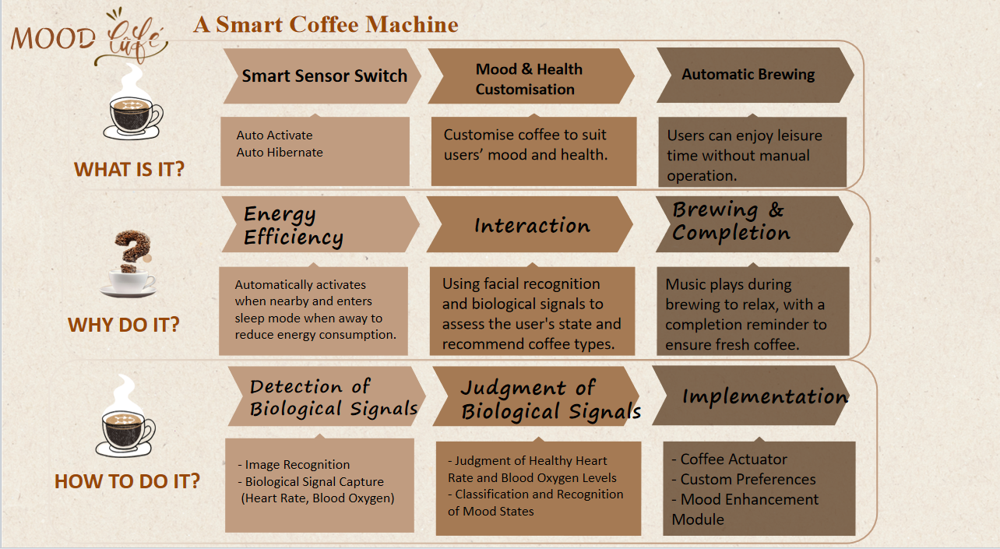
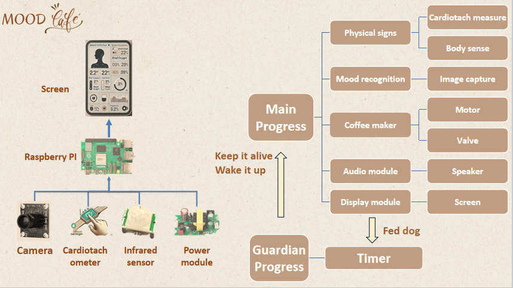

# 📒 Project name
Hello_Embedded_2501-A Smart Emotion-Aware Coffee Machine

This is a repository established by a group of interesting people to create something truly enjoyable. We are thrilled and dedicated to this little charming hand-made craft. 

The project is a smart coffee machine based on the Raspberry PI 5 to recognize images and heart rate signals, adjust the coffee formula to improve the quality of the user's mood.

An intelligent coffee brewing system that understands your physical and emotional state before making the perfect cup — just for you.

## 📌 Overview

This project was developed by Group 17 as part of the **Real-Time Embedded Coding** course at the University of Glasgow (2025). Our system integrates **biological signal monitoring** and **emotional state recognition** to personalize coffee recommendations.

The coffee machine not only detects your presence but also monitors heart rate, blood oxygen levels, and facial expressions to deduce your emotional state. Based on this, it recommends a drink and automatically starts brewing — providing a smart and delightful coffee experience.



### 🎯 Real-time Interaction
- **Wake-up Detection:** Uses PIR (e.g., HC-SR501) infrared sensors to wake the system when a user approaches.
- **Sleep Detection:** Enters low-power mode when no human presence is detected after some time.

### 🧠 Emotional & Physical State Recognition
- **Camera module** analyzes facial expressions (happy/unhappy).
- **Pulse oximeter module** detects real-time heart rate and SpO₂ levels.

### ☕ Smart Coffee Making
- Personalized coffee suggestions based on user mood and health data.
- Manual override: users can choose their favorite drink manually.
- Friendly on-screen interaction and music during brewing.

### ✅ Status Feedback
- Notifies user when coffee is ready.
- Uses weight/laser sensors to detect cup removal.
- Automatically resets to ready mode after user interaction.

---

## Catalogue
- [Introduction](#Introduction)
- [Working Environment](#Working_Environment)
- [Usage](#Usage)
- [Example](#Example)
- [Hardware](#Hardware)
- [How to contribute](#How_to_contribute)
- [Repository_Structure](#Repository_Structure)
- [Media](#Media)
- [Lisence](#Lisence)
- [Autuors and Contacts](#Contacts)
- [Acknowledgements](#Acknowledgements)

## Introduction
This project combines image recognition technology and biological signal detection technology. By detecting the user's current facial expression, heart rate, and blood oxygen levels, it evaluates the user's current emotional and health status, and recommends and automatically makes coffee suitable for the user's physical condition. In addition, the system supports a low-power mode, automatically entering sleep mode when there is no user interaction, saving energy. The ultimate goal of this project is to provide a low-power smart coffee machine that can make coffee tailored to the user's psychological and physiological condition.

## Working_Environment
Ubuntu 22.04.5 on Raspberry5 for now.
Expected to be deployed on different platform. 

## Usage & Example
Using the smart coffee machine is very simple, and the user only needs to follow these steps:
1. **Start the coffee machine**: When the user approaches the coffee machine, it will automatically wake up from sleep mode and enter the "Ready" state.
2. **Emotion and health recognition**: When the user stands in front of the coffee machine, the system will automatically recognize the user's facial expressions and use sensors to obtain the current heart rate and blood oxygen levels.
3. **Recipe recommendation and coffee making**: Based on the user's emotion and health status, the system will automatically recommend a suitable coffee recipe and begin making it.
4. **Completion notification**: Once the coffee is made, the system will emit a notification sound to remind the user to pick up the coffee.

## Hardware
### Hardware List
Infrared sensor * 2, Power module 220VAC~5VDC * 1, Water bumps * 5, Weight sensor/Presure sensor * 2, Heart rate and SpO2 sensor-photoelectric * 2.
### Hardware Connection


## How_to_contribute
##### 1.Fork this repository first.
Click the Fork button to duplicate this repository to your GitHub account.
##### 2.Clone the repository to local
Use git bash to clone repository.
```bash
git clone https://github.com/a7584579/Hello_Embedded_2501.git
cd Hello_Embedded_2501
```
##### 3.Create new branch
Before you start modifying the code, create a new branch. The branch name can describe the feature you want to develop or the problem you want to fix.
```bash
git checkout -b feature       #description of function
```
##### 4.Write codes and test it
- Do code development on your branch.
- Make sure your changes don't break existing functionality, and write the necessary test cases.
- You can run the project's test script locally to verify that the changes take effect.
##### 5.Submit your codes
Please submit with detailed submission instructions that describe the changes you have made.
```bash
git add .
git commit -m "description of changes"
```
##### 6.Push it to github repository
```bash
git push origin feature #description of your push
```
##### 7.Craete Pull Request
Open your repository on GitHub, click the Compare & Pull Request button, fill in the Pull Request description, and submit the merge request. Our maintainers review and give feedback in a timely manner.

#### Notice
Code_Space:  It is utilized to place our code and some related documents. Every file and folder should be documented to clarify your structures. And Readme.md must be written for every file folder.
## Repository_Structure
                
Hello_Embedded_2501/
├── README.md                  # Project overview and usage instructions
├── LICENSE                    # License file (MIT or similar)
├── .gitignore                 # Files and directories to be ignored by Git
├── untitled/                  # Main project source directory
│   ├── build/                 # (Optional) Build output directory
│   ├── images/                # UI screenshots, system diagrams, poster assets
│   ├── include/               # Header files for core logic (e.g., sensors, control)
│   ├── qt_ui/                 # Qt GUI components (e.g., mainwindow.ui, UI classes)
│   ├── src/                   # Main application logic (mood detection, device control)
│   │   └── main.cpp           # Program entry point
│   └── daemon/                # Real-time background services and callbacks


> This repository separates GUI (Qt-based) and core logic.
> The `src/` and `daemon/` directories contain real-time components using C++11 threading and callbacks. 
> The `qt_ui/` folder is reserved strictly for visual interaction (Qt only).
> All code is deployed and tested on Raspberry Pi OS (Debian).


## Lisence
This project is licensed under the MIT License.
## Social Media
Instagram: [https://www.instagram.com/moodcafe_realtime](https://www.instagram.com/moodcafe_realtime?igsh=MW1mZmY5bWo1OWtocQ%3D%3D&utm_source=qr)  
TikTok: [https://www.tiktok.com/@mood_coffee_realtime](https://www.tiktok.com/@mood_coffee_realtime?_t=ZN-8vZu8KfJSHG&_r=1)  
YouTube: [https://youtu.be/QFT3A7u-bKY](https://youtu.be/QFT3A7u-bKY?si=9AdZxWDZZp56725b)
## Contacts
If you have any questions or suggestions, please contact a758457953@gmail.com or visit the project's GitHub page and leave your comments.
